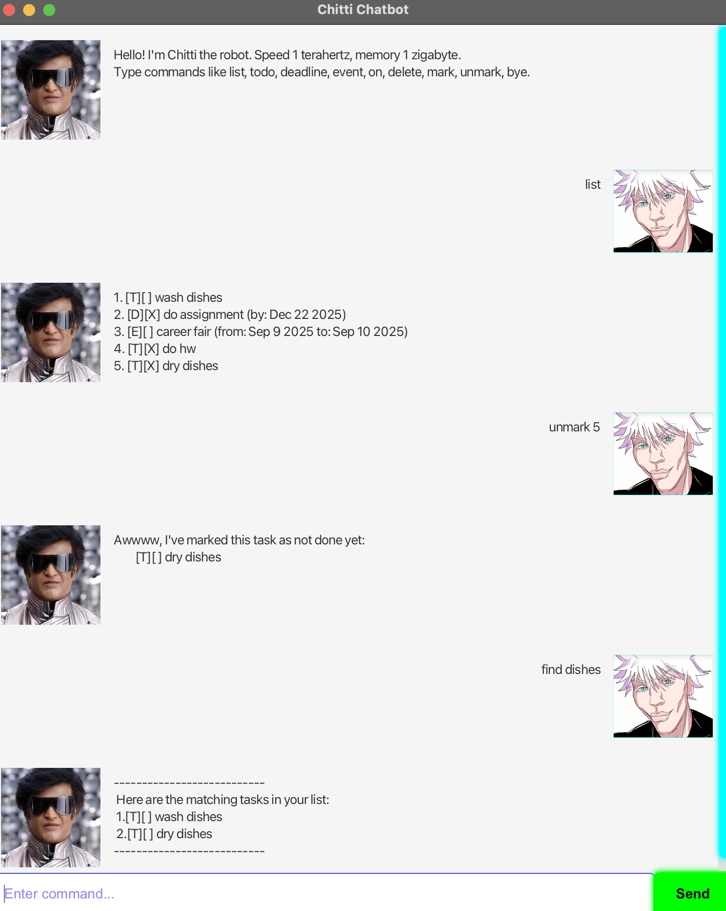

# Chitti User Guide



## A brief intro on Chitti
Chitti is your friendly, smart task-tracking assistant. 
Designed for speed and simplicity, Chitti helps you manage your todos, deadlines, and events directly from your chat window.

## Quick Start
1. Start a chat with Chitti.
2. Type a command like `todo Buy groceries` or `deadline Submit report /by 2023-12-01`.
3. Chitti will confirm your task has been added to your list!

## Adding ToDos
1. A todo you will be adding when it's just a simple task that does not
have any specific deadline
2. To add a todo task, type in the following command:
```
todo <description>
```

3. The expected output will be like this for example:
```
Got it. I've added this task:
  [T][ ] Buy groceries
Now you have 1 task in the list.
```

## Adding Deadlines
1. A deadline is considered as a task that has to be done within
a certain time
2. To add a deadline task, type in the following command:
```
deadline <description> /by <DD-MM-YYYY>
```
3. The expected output will be like this for example:
```
Got it. I've added this task:
  [D][ ] Submit report (by: 1 Dec 2023)
Now you have 2 tasks in the list.
```

## Adding Events
1. An event is considered as a task that is from one time period to another
2. To add an event task, type in the following command:
```
event <description> /from <start time> /to <end time>
```
3. The expected output will be like this for example:
```
Got it. I've added this task:
  [E][ ] Team meeting (from: 2pm to: 3pm)
Now you have 3 tasks in the list.
```

## Viewing your tasks
Now to view your tasks that you have added, simply type in the following
command:
```
list
```
This will output the following for example:
```
Here are the tasks in your list:
1. [T][ ] Buy groceries
2. [D][ ] Submit report (by: Dec 1 2023)
3. [E][ ] Team meeting (from: 2pm to: 3pm)
```

## Marking Feature
1. Marking marks a specific task in your list as completed in order to
get a picture of the number of tasks left to do
2. To mark a task as done, type in the following command:
```
mark <task number>
```
3. The expected output will be like this for example:
```
Great job! I have marked this task as done:
  [D][X] Submit report (by: Dec 1 2023)
```

## Unmarking Feature
1. Unmarking removes a specific task in your list that you have already marked
if you accidentally marked it as down previously
2. To unmark a task as done, type in the following command:
```
unmark <task number>
```
3. The expected output will be like this for example:
```
Awwwww, I have marked this task as not done yet:
  [D][ ] Submit report (by: Dec 1 2023)
```

## Deleting Feature
1. If the task list becomes too messy or cluttered, you can use this to
remove unwanted or completed tasks
2. To delete a task, type in the following command:
```
delete <task number>
```
3. The expected output will be like this for example:
```
Noted. I've removed this task:
    [T][ ] wash dishes
Now you have 4 task/s left in the list
```

## Duplicate Prevention Feature
1. This is to ensure that any previously added tasks will not be
accidentally again
2. Chitti will give you the following message if you added a 
duplicate task:
```
Oops! This task already exists in your list: <task description>
Use 'list' to see your existing tasks.
Use 'findduplicates' to check for duplicate tasks.
```

## Finding feature
This is to find your tasks with the help of a keyword in the task
To find a task, simply type in the following command:
```
find <keyword that is within the task description>
```
The expected output will be like this for example:
```
Here are the matching tasks in your list:
1. [T][ ] wash dishes
2. [T][ ] dry dishes
```

## Exit
Lastly, to exit the chatbot once done managing your tasks, simply type
in the following command:
```
bye
```

### Note: Have fun using my chatbot and get started with your tasks!